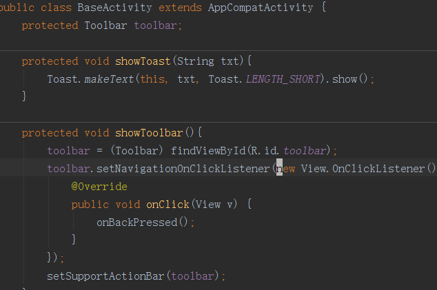

本游戏是以PLASTIC组织的成员为角色制作的一款~~开源~~RPG游戏。 
使用RPG Maker VX ACE编辑器进行制作。

# 内容
主角周明凯在前妻死亡后努力奋斗成为冰封王国的大勇士。 
为救出被抓走的奶茶公主，前往冒险，一路奋斗，结识伙伴，达成梦想。 

### 当前出场人物
+ [周明凯](https://github.com/sg-first)及其~~意淫出来的~~前妻
+ [千里冰封](https://github.com/ice1000)，这是我的[表情包](./Graphics/Faces/ice1000.png) 没错就是我
+ [张新伟](https://github.com/iXinwei)第三个参与战斗的成员
+ [奶茶](https://github.com/Tardis07) 作为女主角登场
   
+ [了解更多关于PLASTIC成员的二三事](https://github.com/ice1000/dialogs)

### 封面

# 说明
+ 开发环境：[RPGMaker VX Ace](http://pan.baidu.com/s/1kUlSmyz "密码：1plm") 合作的话请下载这个。密码自己找~
+ 附送我好不容易找到的RM使用[教程](https://github.com/ice1000/cdfls-game/blob/master/extra/ins.pdf)
+ 以及[脚本编写教程](http://tieba.baidu.com/p/83145477)

# 安装方法
游戏安装包请联系作者。发布后会在此处附上下载链接。

### 如何玩本游戏

#### Windows平台
首先安装上面所述的RPGMaker软件。 
点击解压之后的“Game.exe” 
就行了~

#### Linux平台
不支持。
#### Mac OS X平台
不支持。
#### Android平台
不支持。
#### iOS平台
不支持。
#### Windows Phone平台
不支持。
#### BlackBerry平台
不支持。
#### Raspbian平台
不支持。
